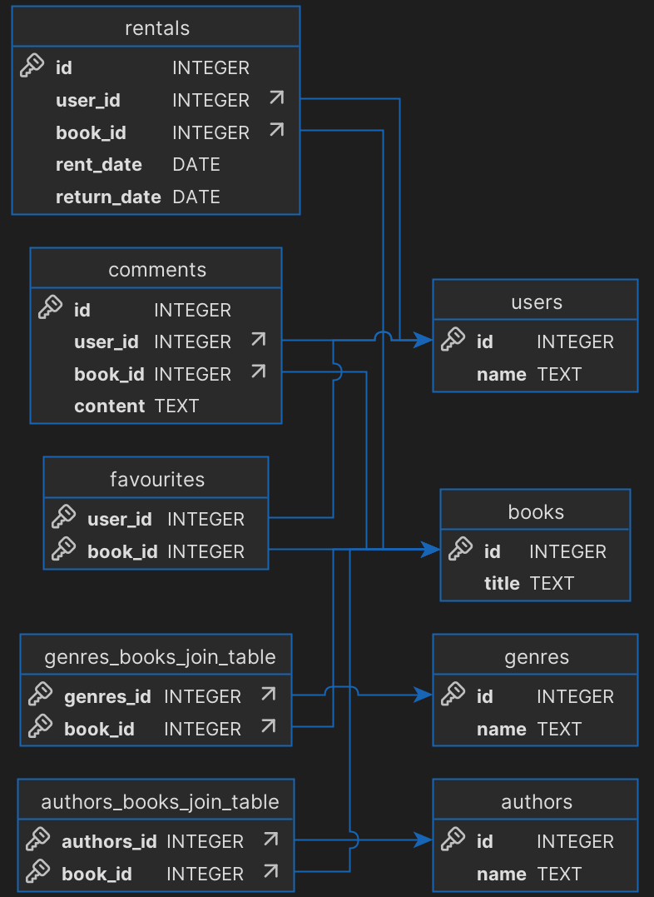

## Build

To build and run a project, you need to have:
 - QT6 (preferably 6.8.3)
 - Cmake version >=3.21

Build follows standard CMake configure and build—no QtCreator needed.
You may need to add `-DCMAKE_PREFIX_PATH="path_to_qt_installation_dir\lib\cmake"` to commands if cmake fails to resolve your Qt version.

### Example build and run procedure on windows with mingw:

#### Requirements:
 - mingw64
 - qt6 mingw version installed
 - mingw bin is added to path

Build:
```cmd
mkdir build
cd build
cmake .. -G "MinGW Makefiles" -DCMAKE_PREFIX_PATH="C:\Qt\6.8.3\mingw_64\lib\cmake"
cmake --build
```

Run:
```cmd
Book.exe
```

## ERD

